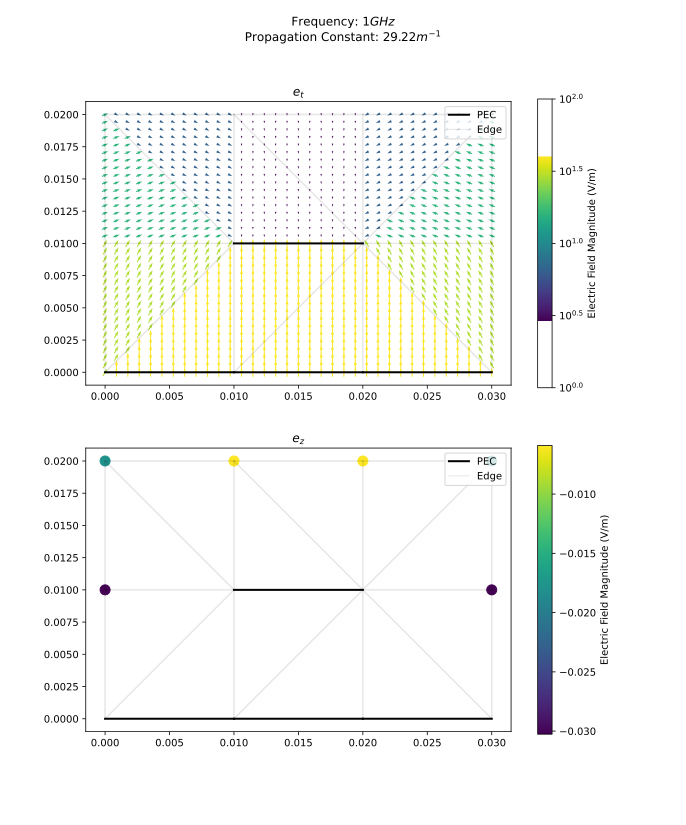
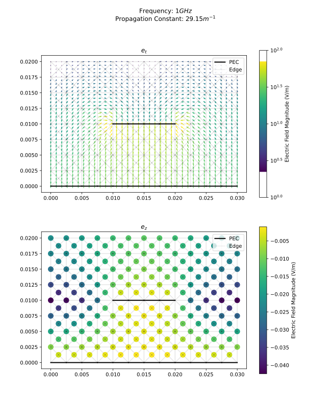
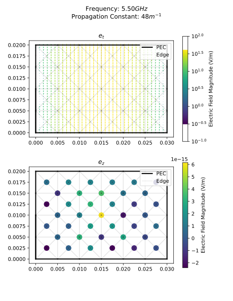
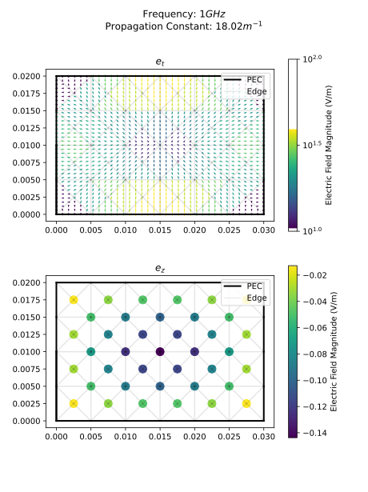

# ECE 5510 2D FEM Waveguide Simulator

Author: Adam Exley

Code: [GitHub Repository](https://github.com/AdamExley/5510EMSolver)

## Using the simulator

### Install dependencies

Requires [Python 3](https://www.python.org/downloads/)

```bash
pip install -r requirements.txt
```

### Run the default simulator
```bash
python sim.py
```
Automatically runs the `uStrip.in` geometry at 1 GHz and plots the electric field distribution.

Does simple mesh resampling to get a finer mesh for the simulation.

### Run simulator with options
```bash
usage: sim.py [-h] [--mode {profile,modes}] [--input {parallelPlateWG.in,rectWG.in,stripLine.in,uStrip.in}] [--freq FREQ] [--resamples RESAMPLES] [--grid GRID] [--n_eigen N_EIGEN]

optional arguments:
  -h, --help            show this help message and exit
  --mode {profile,modes}, -m {profile,modes}
                        Mode to run in. profile: Compute propagation and mode profile at a specific frequency modes: (NOT FULLY WORKING) Compute the propagation constant of the first N_EIGEN modes up to FREQ
  --input {parallelPlateWG.in,rectWG.in,stripLine.in,uStrip.in}, -i {parallelPlateWG.in,rectWG.in,stripLine.in,uStrip.in}
                        Input file
  --freq FREQ, -f FREQ  Frequency to solve at (Default 1e9)
  --resamples RESAMPLES, -r RESAMPLES
                        Number of resamples (Default 3)
  --grid GRID, -g GRID  Field display grid size (Default 50)
  --n_eigen N_EIGEN, -n N_EIGEN
                        Number of eigenvalues to compute (Default 2)
```


## Results

### Basic Problem

The base problem was that given in the project description.

1cm uStrip with 1cm ground plane spacing and 1cm padding on each side. `eps_r = 2` for the substrate. 1GHz frequency.




The propagation constant of this result is higher than expected, but the mode profile is as expected.

Approximations give `eps_eff` around 1.6 although this simulation gives `eps_eff` close to 2.

Further testing showed that this is likely due to insufficient padding around the uStrip, as the field magnitude is still high at the edges of the simulation domain. A larger domain would likely give a more accurate result. For example, giving a triangle in the upper-half-corner of the domain a very high `eps_r` of ~10 artificially increases the `theta_bound`, but the resulting propagation constant is still around 29.9, indicating that this is true algorithmic convergence and not just it consistently hitting the upper limit of the `theta_bound`. This is also supported by the behavior of other geometries in the simulation.

#### Upscaled

The same simulation was run with 5x resampling to give a finer mesh.




### Rectangular Waveguide

A 3cm x 1cm vacuum-filled rectangular waveguide.

Analysis gives TE10 cutoff of ~5GHz.

$f_{c, TE10} = \frac{\frac{\pi}{0.03cm}c}{2\pi}\approx 5GHz$


#### TE10 at 5.5GHz




$k_c = \frac{\pi}{0.03cm} = 104.72 \frac{rad}{m}$

$k = \omega\sqrt{\mu\epsilon} = \frac{2\pi f}{c}  = 115.27 \frac{rad}{m}$

$\beta_{expected} = \sqrt{k^2-k_c^2} = \sqrt{115.27^2 - 104.72^2} = 48.18 \frac{rad}{m}$

$\beta_{sim} = 48.0 \frac{rad}{m}$

This is **great** agreement considering the simplicity of this simulator.


#### Thoroughly Below-Cutoff, 1GHz

Here's some interesting behavior that I didn't expect. Solver actually converges to a solution for a mode that is well below cutoff, but resembles TM11 mode.

There is clearly some error here, but I'm honestly not sure where it is (I've been trying to hunt it down), but could be related to the formulation not well enforcing magnetic boundary conditions.




## Solver Details

It was attempted first to use the `scipy.sparse.linalg.eigsh` function to solve the eigenvalue problem, but this was not always successful.

Although other options like `SLEPc` could be used, the overhead in setting up the problem and installing the library was considerable.

In the end I implemented the modified Lanczos method as described in lecture notes.

**This solver is slow** as I chose to implement it in Python for simplicity in reading and iteration. It also does not take advantage of the sparsity of the matrix, which could be a significant improvement.

It also seems to have some problems with detecting convergence, but regardless, I'm happy with it's basic functionality.


## Input file format

Simulation input files are in the following text format:

```
Points:
    0 : ( <x>, <y>)
Triangles:
    0: ( <i>, <j>, <k>) (<eps_r>)
PEC:
    Edge(<i>,<j>)
```
Where `<x>, <y>` are the x and y coordinates of a point, and `<i>, <j>, <k>` are the indices of the points , and `<eps_r>` is the relative permittivity of the triangle.

For example, here is the uStrip input file:
``` txt
Points:
    0 : (   0,   0)
    1 : (0.01,   0)
    2 : (0.02,   0)
    3 : (0.03,   0)
    4 : (   0,0.01)
    5 : (0.01,0.01)
    6 : (0.02,0.01)
    7 : (0.03,0.01)
    8 : (   0,0.02)
    9 : (0.01,0.02)
    10: (0.02,0.02)
    11: (0.03,0.02)
Triangles:
    0: ( 0, 5, 4) (2)
    1: ( 0, 1, 5) (2)
    2: ( 1, 6, 5) (2)
    3: ( 1, 2, 6) (2)
    4: ( 2, 3, 6) (2)
    5: ( 3, 7, 6) (2)
    6: ( 4, 5, 8)
    7: ( 5, 9, 8)
    8: ( 5, 6, 9)
    9: ( 6,10, 9)
    10: ( 6,11,10)
    11: ( 6, 7,11)
PEC:
    Edge(0,1)
    Edge(1,2)
    Edge(2,3)
    Edge(5,6)
```

